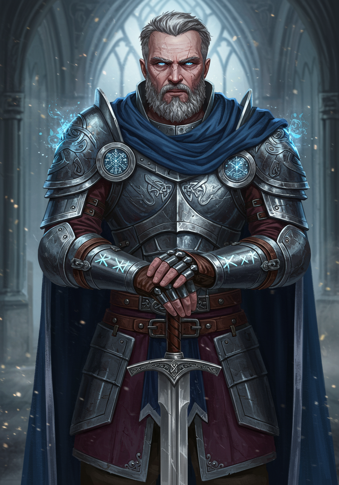
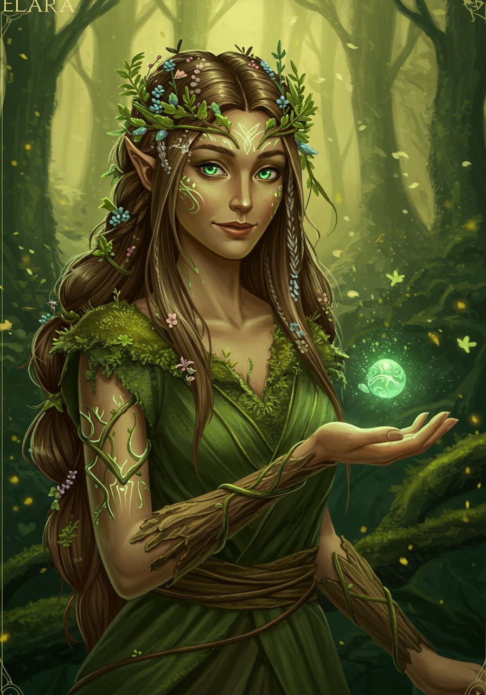
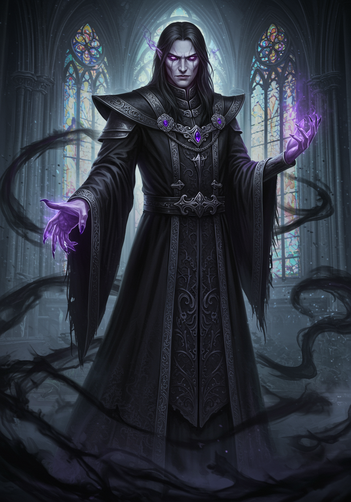

# AI Art Generator

A Python CLI tool for generating visual assets using multiple AI image generation services including Google GenAI (Imagen), Google Vertex AI (Imagen 3/4), and OpenAI GPT-4o.

## Features

- **Multiple AI Services**: Support for Google GenAI, Google Vertex AI (Imagen 3/4), and OpenAI GPT-4o
- **Batch Generation**: Concurrent processing with intelligent rate limiting
- **Flexible Configuration**: YAML-based configuration with service-specific settings
- **Advanced Parameters**: Aspect ratio, quality, safety filters, and more
- **Structured Prompts**: JSON-based prompt management with metadata
- **Progress Tracking**: Real-time progress bars and detailed reporting

## Gallery

<p align="center">
  
  
  
</p>

<p align="center">
  <em>Examples generated with advanced structured prompts using Google GenAI</em>
</p>

## Quick Start

### Installation

```bash
# Clone the repository
git clone <your-repo-url>
cd ai-art-generator

# Install dependencies using UV (recommended)
uv sync
```

### Configuration

1. **Copy configuration template:**
   ```bash
   cp config.yaml.example config.yaml
   ```

2. **Set up API keys in `.env` file:**
   ```bash
   cp .env.example .env
   # Edit .env with your API keys
   ```

3. **For Google Vertex AI (optional):**
   ```bash
   # Install Google Cloud CLI and authenticate
   gcloud auth application-default login
   ```

### Basic Usage

```bash
# Test connection
uv run python art-generator.py --test-connection

# Generate from a prompt file
uv run python art-generator.py --prompts my-prompts.json

# Generate specific images
uv run python art-generator.py --prompts my-prompts.json --image-id background-1

# Use different service
uv run python art-generator.py --prompts my-prompts.json --service vertex
```

## Prompt File Format

Create a JSON file with your prompts:

```json
{
  "prompts": [
    {
      "id": "bg-forest",
      "category": "background",
      "title": "Mystical Forest",
      "filename": "bg-forest.png",
      "description": "A mystical forest with glowing mushrooms",
      "prompt": "A mystical forest scene with bioluminescent mushrooms, ethereal lighting, fantasy art style"
    },
    {
      "id": "char-wizard",
      "category": "character", 
      "title": "Wise Wizard",
      "filename": "char-wizard.png",
      "description": "An elderly wizard character",
      "prompt": "Portrait of a wise elderly wizard with long white beard, magical robes, fantasy art"
    }
  ]
}
```

## Services

### Google GenAI (Imagen)

```bash
# Set API key in .env
GOOGLE_AI_API_KEY="your-api-key"

# Generate images
uv run python art-generator.py --prompts prompts.json --service genai
```

### Google Vertex AI (Imagen 3/4)

```bash
# Set project ID in .env
GOOGLE_CLOUD_PROJECT="your-project-id"
GOOGLE_CLOUD_LOCATION="us-central1"

# Authenticate (one-time setup)
gcloud auth application-default login

# Generate with Imagen 4
uv run python art-generator.py --prompts prompts.json --service vertex --model imagen-4.0-generate-preview-06-06
```

### OpenAI GPT-4o

```bash
# Set API key in .env  
OPENAI_API_KEY="your-api-key"

# Generate images
uv run python art-generator.py --prompts prompts.json --service gpt4o
```

## Advanced Usage

### Batch Generation with Options

```bash
# Generate backgrounds with 16:9 aspect ratio
uv run python art-generator.py --prompts prompts.json --type backgrounds --aspect-ratio 16:9

# Generate multiple variations per prompt
uv run python art-generator.py --prompts prompts.json --images-per-prompt 3

# Custom quality settings
uv run python art-generator.py --prompts prompts.json --service vertex --quality ultra

# Custom output directory
uv run python art-generator.py --prompts prompts.json --output-dir ./my-images
```

### Dry Run Mode

Test your configuration without generating images:

```bash
uv run python art-generator.py --prompts prompts.json --dry-run
```

## Configuration

The `config.yaml` file allows you to set defaults for each service:

```yaml
generation:
  default_service: "vertex"
  images_per_prompt: 1

vertex:
  model: "imagen-4.0-generate-preview-06-06"
  defaults:
    aspect_ratio: "1:1"
    quality: "standard"
  categories:
    background:
      aspect_ratio: "16:9"
    character:
      aspect_ratio: "3:4"
```

## Development

### Setting up Development Environment

```bash
# Install with development dependencies
uv sync --dev

# Format code
uv run black .

# Lint code  
uv run ruff check

# Run tests (when available)
uv run pytest
```

### Adding New Generators

1. Create a new generator class in `generators/`
2. Inherit from `BaseGenerator`
3. Implement required methods
4. Add service option to CLI

## Rate Limits & Performance

The tool automatically handles rate limiting for each service:

- **Google GenAI**: 8 concurrent threads (50 RPM)
- **Google Vertex AI Imagen 3**: 6 concurrent threads (50 RPM)  
- **Google Vertex AI Imagen 4**: 4 concurrent threads (20 RPM)
- **OpenAI GPT-4o**: 5 concurrent threads (varies by tier)

## Troubleshooting

### Authentication Issues

**Google Vertex AI:**
```bash
# Re-authenticate
gcloud auth application-default login

# Verify project access
gcloud auth application-default print-access-token
```

**API Key Issues:**
- Verify `.env` file format
- Check API key permissions
- Test connection: `--test-connection`

### Common Errors

- **"Module not found"**: Run `uv sync` to install dependencies
- **"API key not found"**: Check `.env` file exists and has correct format
- **"Authentication failed"**: Re-run authentication commands

## Contributing

We welcome contributions to the AI Art Generator! Here's how you can help:

### Getting Started

1. **Fork the repository** on GitHub
2. **Clone your fork** locally:
   ```bash
   git clone https://github.com/yourusername/ai-image-generator.git
   cd ai-image-generator
   ```
3. **Install development dependencies**:
   ```bash
   uv sync --dev
   ```

### Development Workflow

1. **Create a feature branch**:
   ```bash
   git checkout -b feature/your-feature-name
   ```

2. **Make your changes** following our coding standards:
   - Run `uv run black .` to format code
   - Run `uv run ruff check` to lint
   - Write tests for new functionality (when test framework is added)

3. **Test your changes**:
   ```bash
   # Test the CLI works
   uv run python art-generator.py --test-connection
   
   # Test with dry run
   uv run python art-generator.py --prompts example-prompts.json --dry-run
   ```

4. **Commit your changes**:
   ```bash
   git add .
   git commit -m "Add: brief description of your changes"
   ```

5. **Push and create a Pull Request**:
   ```bash
   git push origin feature/your-feature-name
   ```

### Contribution Types

- **Bug fixes**: Report issues and submit fixes
- **New AI services**: Add support for additional image generation APIs
- **Features**: Enhance existing functionality or add new capabilities
- **Documentation**: Improve README, add examples, or write guides
- **Testing**: Add unit tests and integration tests

### Code Style

- Follow PEP 8 guidelines
- Use Black for code formatting
- Use Ruff for linting
- Add type hints where appropriate
- Write descriptive commit messages

### Adding New AI Services

To add support for a new AI image generation service:

1. Create a new generator in `generators/new_service.py`
2. Inherit from `BaseGenerator`
3. Implement required methods: `generate_image()`, `_get_api_parameters()`
4. Add service option to CLI argument parser
5. Update configuration examples and documentation

### Questions?

Feel free to open an issue for questions, suggestions, or discussions about potential contributions.

## License

This project is licensed under the MIT License - see the [LICENSE](LICENSE) file for details.